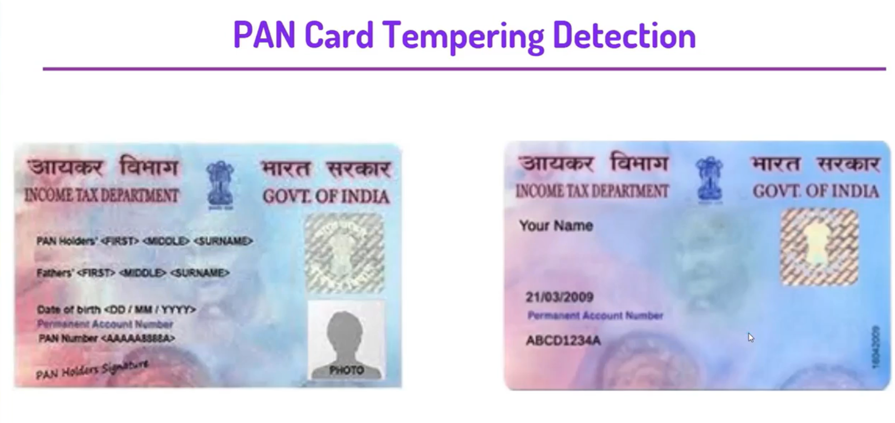

  
 

<h3> Link-https://pan-card-tampering-app.herokuapp.com/ </h3>
<i>

<h3><i> IN THIS PROJECT. WE WILL DETECT TAMPERING OF PAN CARD USING COMPUTER VISION. THIS PROJECT WILL HELP THE DIFFERENT ORGANIZATIONS IN DETECTING WHETHER THE ID I.E. THE PAN CARD PROVIDED TO THEM BY THEIR EMPLOYEES OR CUSTOMERS OR ANYONE IS ORIGINAL OR NOT. </h3>

 

  <h2>PAN Card Tempering Detection </h2>

<h3> 1. GET IMAGES FROM USER </h3>
<h3> 2. CHECK FOR SIZE AND FORMAT OF THE IMAGE </h3>
<h3> 3. CHANGE SHAPE AND SIZE OF IMAGE ACCORDING TO THE ORIGINAL IMAGE </h3>
<h3> 4. CONVERT THE IMAGE TO GRAYSCALE </h3>
<h3> 5. FIND THE SIMILARITY INDEX OF THE IMAGES. </h3>
<h3> 6. FINDING THE THRESHOLD OF THE IMAGE. </h3>
<h3> 7. FINDING CONTOUR AND GRAB THOSE CONTOUR USING IMUTILS </h3>
<h3> 8.DRAW A BOUNDING RECTANGLE USING THESE CONTOURS. </h3>
<h3> 9. PLOT DIFFERENCE, THRESHOLD, ORIGINAL AND TAMPERED IMAGE </h3>
 <h3>  10. COMPARE ALL THE IMAGES AND CHECK THE SIMILARITY SCORE TO DECIDE TAMPERING. </h3>

     
  
  <h1> Screenshots </h1>
  <h2> Input Screen </h2>
 
  
    
  
<h2> Output Screen </h2> 

   
   
    

### Give It a Star if you liked the project 
